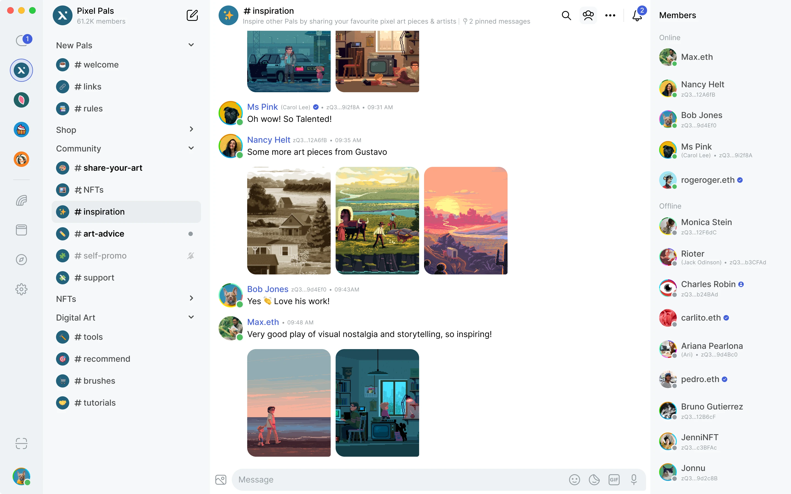

<div align="center">
    

[](https://github.com/status-im/status-app/releases/latest)

</div>

# Status App

The [**Status App**](https://status.app/) is a privacy-first, decentralised messenger built with [Nim](https://nim-lang.org/) and [Qt/QML](https://doc.qt.io/qt-5/qmlapplications.html). It offers end-to-end encrypted messaging, community chats, and Ethereum wallet integration — all without requiring a phone number or email.




## 📑 Table of Contents

- [Status App](#status-app)
  - [📑 Table of Contents](#-table-of-contents)
  - [🚀 Download \& Install](#-download--install)
    - [Supported Versions](#supported-versions)
    - [Windows](#windows)
    - [Linux](#linux)
    - [macOS](#macos)
  - [🛠️ Build from Source](#️-build-from-source)
    - [Building Mobile](#building-mobile)
  - [🤝 Contributing](#-contributing)
  - [📚 Documentation](#-documentation)

## 🚀 Download & Install

Get the latest release for your platform:

- **Windows**: [Download EXE](https://github.com/status-im/status-app/releases/latest)
- **Linux**: [Download Tarball](https://github.com/status-im/status-app/releases/latest)
- **macOS**: [Download DMG](https://github.com/status-im/status-app/releases/latest)

### Supported Versions

|Windows|Linux|macOS|
| --- | --- | --- |
| Intel chip (no native Windows ARM build yet) | Continuous effort to support the lowest Ubuntu LTS version. | ARM chip |
| Windows 11 is used for testing | Actively tested on Ubuntu 22.04 | MacOS latest version |
| | Should run on most of Linux flavours using glibc 2.31 or newer |  |

### Windows

1. [Download](https://github.com/status-im/status-app/releases/latest) the `.exe` file.
2. Run the `.exe` installer.
3. Launch the installed app 🎉

### Linux

1. [Download](https://github.com/status-im/status-app/releases/latest) the `.tar.gz` file.
2. Extract the tarball file (replace `*` with the version)
    ```shell
    cd ~/Downloads
    tar xvf StatusIm-Desktop-*.tar.gz
    ```
3. Optionally, [verify the Status app GPG signature](https://status.app/help/getting-started/download-status-for-linux#verify-the-status-app-gpg-signature).
4. Go to the directory where it extracted and double-click the AppImage file 🎉

### macOS

1. [Download](https://github.com/status-im/status-app/releases/latest) the `.dmg` file.
2. Open it and drag `Status.app` to the Applications folder.
3. Open the Applications folder and double-click the Status icon 🎉


## 🛠️ Build from Source

To build Status from source, follow the instructions specific to your operating system. Detailed build instructions are available in the official documentation:

- [Building Desktop](BUILDING.md)
- [Building Mobile](/mobile/README.md)

### Building Mobile

To build Status Mobile from source, follow the instructions specific to your operating system. Detailed build instructions are available in the [official documentation](BUILDING.md).

## 🤝 Contributing

We welcome contributions from the community! To get started:

<!-- TODO Improve the contributing guide to be more about how to contribute -->
<!-- TODO add guide on how to translate -->
<!-- TODO Create a guide per persona in the contributing guide -->

- Read our [Contributing Guidelines](CONTRIBUTING.md).
  - [Developing Status](CONTRIBUTING.md#️-developing)
  - [Testing Status](CONTRIBUTING.md#-desktop-status-app-community-testing)
- Check out [good first issues](https://github.com/status-im/status-app/contribute) to get involved.
- Join the [#feedback-desktop](https://status.app/cc/G-EAAORobqgnsUPSVCLaSJr855iXTIdQiY1Q0ckBe8dWWEBpUAs9s8DTjWEpvsmpE83Izx1JWQuZrWWKUoxiXCwdtB-wPBzyvv_n9a0F61xTaPZE7BEJDC7Ly_WcmQ4tHRAKnPfXE_JUtEX_3NhnXQN0eh4ue0D77dWvaDpDrSi0U0CaGLZ-pqD_iV0z9RMFE2LKulDZdwL40etJ8lxjyTFoxS0lUhdWKinIOk8qBmJJpCmsqMrSklEU#zQ3shZeEJqTC1xhGUjxuS4rtHSrhJ8vUYp64v6qWkLpvdy9L9) and [#feedback-mobile](https://status.app/cc/G-EAAOTgmsumqFvQZ-DSRkmf6xZuG-jQBrqnB6ytivISS1qeYURpfrzeMMePtpp7Inw_qy_cLdpZLJNUgOmfMHIZ4n2zSTr-n9u34C4yZa7c4JGLz9U6GIfjPqa0J0Ng2GC_Pu76QxgM-1v0z8V0PxxAf3fdHNbQXy-vfqWhK2iF0E6AaaJMh3sCmp_YpfFwR0DPmDIORPwdI_5ot4VZpkSb9FCkBwJO0xKNc5zI4oYpjfAhZVAyNWIHJs0D#zQ3shZeEJqTC1xhGUjxuS4rtHSrhJ8vUYp64v6qWkLpvdy9L9) channels on Status.


## 📚 Documentation

- [📘 User Help documentation](https://status.app/help)
- [🛠️ Installation Guide](https://status.app/help/getting-started#for-new-users)
- [🏗️ Building Desktop from Source](BUILDING.md)
- [📱 Building Mobile from Source](/mobile/README.md)
- [🏛️ Architecture Docs](docs/architecture.md)
- [🤝 Contributing Guide](CONTRIBUTING.md)
- [💡 You have an idea for a cool feature or improvement?](https://discuss.status.app/c/features/51)
- [🗺️ Status Roadmap](/docs/roadmap.md)
  - [🌟 Feature FURPS](/docs/FURPS)


&nbsp;

---

For more information, visit our [official website](https://status.app/) or explore our [GitHub organization](https://github.com/status-im).

This project is tested with BrowserStack.
