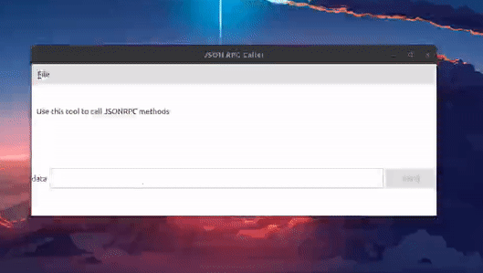

# nim-status-client

Experiments calling status-go from nim, inspired in [nim-stratus](https://github.com/status-im/nim-stratus) by [@arnetheduck](https://github.com/arnetheduck)




```
# 1. Install nim 1.2.0

# 2. Install QT, and add it to the PATH
export PATH=$PATH:/path/to/Qt/5.14.2/gcc_64/bin


# 3. Clone and build DOtherside
git clone https://github.com/filcuc/DOtherSide
cd DOtherSide
mkdir build && cd build
cmake ..
make


# 4. Setup Library Path
export LD_LIBRARY_PATH=$LD_LIBRARY_PATH:/path/to/dotherside/build/lib


# 5. Copy libstatus.a to repo. Can be obtained from `status-react/result`
# by executing `make status-go-desktop`


# 6. 
nimble build
./nim_status_client
```
