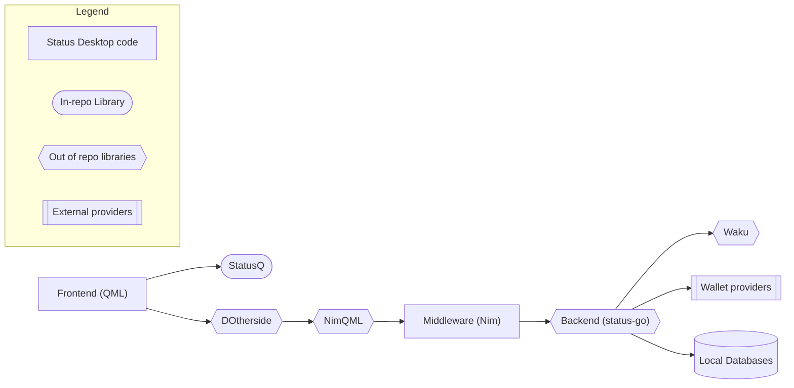

# Architecture of Status Desktop

## Top level architecture

This shows the flow from the UI all the way to the backend.

We do not use servers. [status-go](https://github.com/status-im/status-go) is what our app considers the backend and as such, it has it's own local databases to contain the user data.

