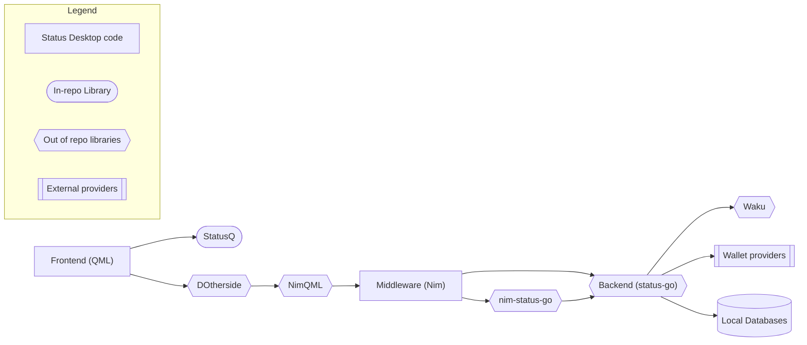
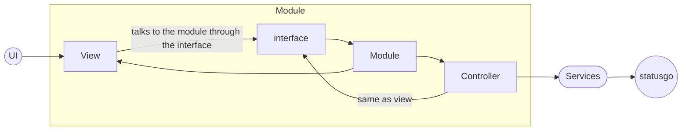
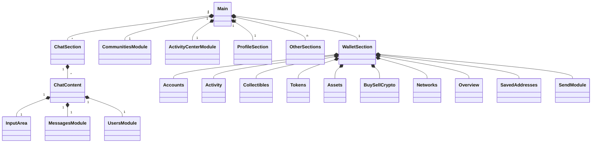

# Architecture of the Status App

## Top level architecture

This shows the flow from the UI all the way to the backend.

We do not use servers. [status-go](https://github.com/status-im/status-go) is what our app considers the backend and as such, it has it's own local databases to contain the user data.

## Standard Nim module

This is the way how most of our Nim modules are assembled.

## Nim Middleware architecture

Shows how the Nim modules are connected. The Nim modules are more often than not associated with the UI view they represent.

