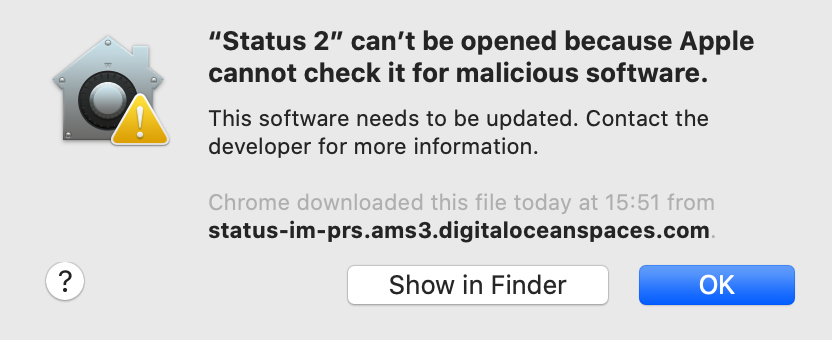

# Description

This document describes the process of notarizing a MacOS application.

# Notarization

The process [Software Notarization](https://developer.apple.com/documentation/security/notarizing_macos_software_before_distribution) is necessary to avoid [Gatekeeper](https://en.wikipedia.org/wiki/Gatekeeper_(macOS)) warnings which look like this:



According to Apple the Notarization process will:

>Give users even more confidence in your software by submitting it to Apple to be notarized. The service automatically scans your Developer ID-signed software and performs security checks. When it's ready to export for distribution, a ticket is attached to your software to let Gatekeeper know it's been notarized.

https://developer.apple.com/developer-id/

The process involves the following steps:

>When you click Next, Xcode uploads your archive to the notary service. When the upload is complete, the notary service begins the scanning process, which usually takes less than an hour. (...) When the notarization process finishes, Xcode downloads the ticket and staples it to your archive. At that point, export your archive again to receive a distributable version of your software that includes the notary ticket.

https://developer.apple.com/documentation/security/notarizing_macos_software_before_distribution

# Tickets

>Notarization produces a ticket that tells Gatekeeper that your app is notarized. After notarization completes successfully, the next time any user attempts to run your app on macOS 10.14 or later, Gatekeeper finds the ticket online. This includes users who downloaded your app before notarization.

https://developer.apple.com/documentation/security/notarizing_macos_software_before_distribution/customizing_the_notarization_workflow

# Authentication

The notarization process requires authentication. 

>Add the `username` and `password` options to supply your App Store Connect credentials. Because App Store Connect now requires two-factor authentication (2FA) on all accounts, you must create an app-specific password for `altool`, as described in Using app-specific passwords.

https://support.apple.com/en-us/HT204397

# Tools

Notarization can be performed by Xcode, or using the command line `xcrun altool` utility:
```sh
% xcrun altool --notarize-app
               --primary-bundle-id "com.example.ote.zip"
               --username "AC_USERNAME"
               --password "@keychain:AC_PASSWORD"
               --asc-provider <ProviderShortname>
               --file OvernightTextEditor_11.6.8.zip
```
The request is created which has a UUID assigned to it which can be used to check progress:
```sh
% xcrun altool --notarization-info 2EFE2717-52EF-43A5-96DC-0797E4CA1041 -u "AC_USERNAME"
```
And once completed the ticket can be "stapled" to the bundle:
```
% xcrun stapler staple "Overnight TextEditor.app"
```
https://developer.apple.com/documentation/security/notarizing_macos_software_before_distribution/customizing_the_notarization_workflow

# Script

Our process is automated using the [`scripts/notarize-macos-pkg.sh`](../scripts/notarize-macos-pkg.sh) script, which performs all the necessary steps in CI:
```
../scripts/notarize-macos-pkg.sh pkg/StatusIm-Desktop-v0.1.0-beta.9-39582e.dmg
```
But it requires certain credentials to be provided:

* `MACOS_NOTARIZE_TEAM_ID` - Apple Team ID
* `MACOS_NOTARIZE_USERNAME` - Apple Dev Portal Username
* `MACOS_NOTARIZE_PASSWORD` - Apple Dev Portal Password or Keystore with password

# Links

* https://scriptingosx.com/2019/09/notarize-a-command-line-tool/
* https://stackoverflow.com/questions/56890749/macos-notarize-in-script
* https://github.com/rednoah/notarize-app
* https://support.apple.com/en-us/HT204397
