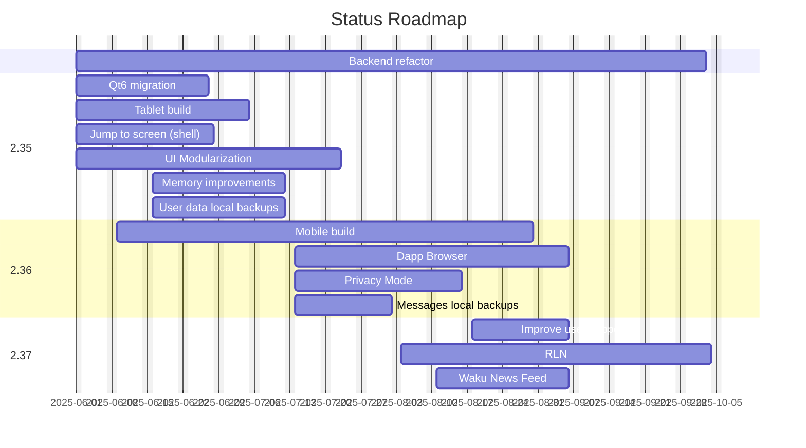

# Status Roadmap

## 2025 H2

### 2.35

Epic: https://github.com/status-im/status-desktop/issues/17966

Estimated release: Mid-End July

#### Features:

- [Backend refactor](https://github.com/status-im/status-go/issues/6435) 
  - Runs parallel to other features and doesn't need to be shipped to any particular milestones
  - No API changes are expected until the Chat SDK is integrated
  - [Roadmap and Documentation](https://zealous-polka-dc7.notion.site/Backend-Refactoring-2078f96fb65c80d8954ae8fc651b3a33)
- [QT6 migration](https://github.com/status-im/status-desktop/issues/17622)
- [Tablet Build](https://github.com/status-im/status-desktop/issues/17941)
- [Jump to screen (Shell)](https://github.com/status-im/status-desktop/issues/17971)
- [Memory improvements](https://github.com/status-im/status-go/issues/6544)
- [UI modularization](https://github.com/status-im/status-desktop/issues/17872)
- [Backup user data locally](https://github.com/status-im/status-desktop/issues/18106)

### 2.36

Epic: https://github.com/status-im/status-desktop/issues/18029

Estimated release: End of August

### Features:

- [Mobile build](https://github.com/status-im/status-desktop/issues/18082)
- [Dapp Browser](https://github.com/status-im/status-desktop/issues/17970)
- [Privacy mode](https://github.com/status-im/status-desktop/issues/17619)

### 2.37

Epic not created yet as it's too early to know exactly what will be worked on. The taks listed below in the graph are estimates of what could bring value.

### Visualisation

