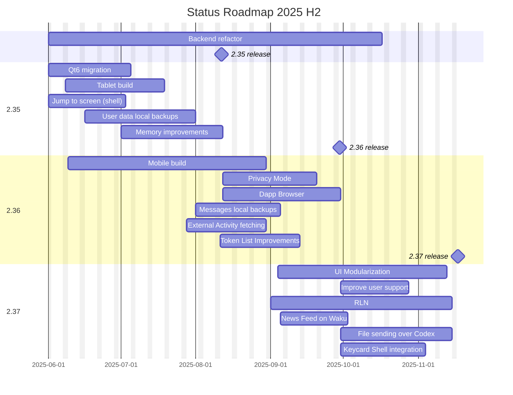

# Status Roadmap

## Table of Contents
- [2025 H2](#2025-h2)
  - [Gantt Chart](#gantt-chart)
  - [2.35](#235)
  - [2.36](#236)
  - [2.37](#237)

## 2025 H2

### Gantt Chart

### 2.35

Release Epic: https://github.com/status-im/status-desktop/issues/17966

#### Features:

- [Backend refactor](https://github.com/status-im/status-go/issues/6435) 
  - Runs parallel to other features and doesn't need to be shipped to any particular milestones
  - No API changes are expected until the Chat SDK is integrated
  - [Roadmap, Documentation and FURPS](https://zealous-polka-dc7.notion.site/Backend-Refactoring-2078f96fb65c80d8954ae8fc651b3a33)
  - In Progress ⏳ 22% 🟩⬜⬜⬜⬜ (+2%) (estimated progress as not all subtasks are created)
- [QT6 migration](https://github.com/status-im/status-desktop/issues/17622)
  - No provided FURPS at the moment
    - This is about maintaing the same level of quality as with QT5 but with QT6 instead.
  - In Progress ⏳ 🟩🟩🟩🟩🟨 92% (+1%)
- [Tablet Build](https://github.com/status-im/status-desktop/issues/17941)
  - [FURPS](/docs/FURPS/tablet-build.md)
  - In Progress ⏳ 🟩🟩🟩🟩⬜ 86%
- [Jump to screen (Shell)](https://github.com/status-im/status-desktop/issues/17971)
  - [FURPS](/docs/FURPS/jump-to-screen-shell.md)
  - Done ✅ 🟩🟩🟩🟩🟩 100%
- [Backup user data locally](https://github.com/status-im/status-desktop/issues/18106)
  - [FURPS](/docs/FURPS/local-user-backups.md)
  - Done ✅ 🟩🟩🟩🟩🟩 100% (+4%)
- [Memory and Performance improvements](https://github.com/status-im/status-desktop/issues/18296)
  - No provided FURPS at the moment as this is mostly about profiling and fixing issues found.
  - In Progress ⏳ 🟩🟩🟩⬜⬜ 65% (+5%)

### 2.36

Release Epic: https://github.com/status-im/status-desktop/issues/18029

### Features:

- [Mobile build](https://github.com/status-im/status-desktop/issues/18082)
  - [FURPS](/docs/FURPS/mobile-build.md)
  - Progress is also inherited from the Tablet Epic above
  - In Progress ⏳ 🟩⬜⬜⬜⬜ 26% (+3%)
- [Privacy mode](https://github.com/status-im/status-desktop/issues/17619)
  - [FURPS](/docs/FURPS/privacy-mode.md)
  - In Progress ⏳ (analysis and design phase)
- [Dapp Browser](https://github.com/status-im/status-desktop/issues/17970)
  - [FURPS](/docs/FURPS/dapp-browser.md)
  - In Progress ⏳ 🟨⬜⬜⬜⬜ 10% (+10%)
- [Opt-in Messages local backup](https://github.com/status-im/status-desktop/issues/18527)
  - In Progress ⏳ ⬜⬜⬜⬜⬜ 8% (+8%)
- [External Activity fetching](https://github.com/status-im/status-desktop/issues/17188)
  - In Progress ⏳
- Ethereum Follow Protocol
- Improve Token List and Support custom tokens

### 2.37

Not all Epics are created yet as it's too early to know exactly what will be worked on. The taks listed below are estimates of what could bring value.

- [UI modularization](https://github.com/status-im/status-desktop/issues/17872)
  - [FURPS](/docs/FURPS/ui-modularization.md)
  - In Progress ⏳ 🟩⬜⬜⬜⬜ 26% (+1%)
- Improve User support
- RLN
  - Dependant on the Chat SDK being (partialy) implemented and integrated as part of the Backend refactor.
- News Feed on Waku
- File sending over Codex
  - Dependant on Codex being available in Light mode for mobile and having a C library.
- Keycard Shell Integration

