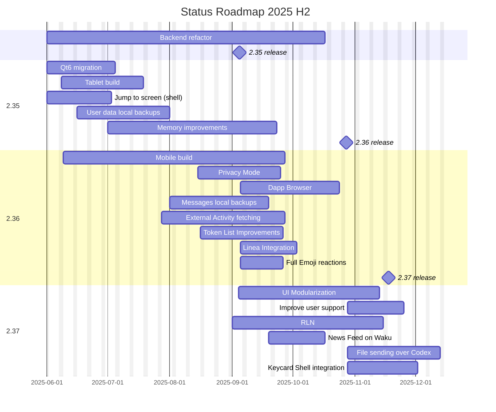

# Status Roadmap

## Table of Contents
- [Status Roadmap](#status-roadmap)
  - [Table of Contents](#table-of-contents)
  - [2025 H2](#2025-h2)
    - [Gantt Chart](#gantt-chart)
    - [2.35](#235)
      - [Features](#features)
    - [2.36](#236)
      - [Features](#features-1)
    - [2.37](#237)
      - [Features](#features-2)

## 2025 H2

### Gantt Chart

```mermaid
gantt
    title Status Roadmap 2025 H2
    excludes    weekends
    dateFormat  YYYY-MM-DD

    Backend refactor        :2025-06-01, 100d

    2.35 release :milestone, m235, 2025-09-04, 1d

    section 2.35
    Qt6 migration           :2025-06-01, 26d
    Tablet build            :t1, 2025-06-08, 31d
    Jump to screen (shell)  :2025-06-01, 24d
    User data local backups :lb1, 2025-06-16, 34d
    Memory improvements     :mi1, 2025-07-01, 60d

    2.36 release            :milestone, m236, 2025-10-27, 1d

    section 2.36
    Mobile build            :2025-06-09, 80d
    Privacy Mode            :2025-08-15, 29d
    Dapp Browser            :after m235, 35d
    Messages local backups  :mlb, after lb1, 35d
    External Activity fetching :2025-07-28, 45d
    Token List Improvements  :2025-08-16, 30d
    Linea Integration       :after m235, 20d
    Full Emoji reactions    :after m235, 15d

    2.37 release             :milestone, m237, 2025-11-17, 1d

    section 2.37
    UI Modularization           :2025-09-04, 50d
    Improve user support        :after m236, 20d
    RLN                         :2025-09-01, 55d
    News Feed on Waku           :after mlb,  20d
    File sending over Codex     :after m236, 34d
    Keycard Shell integration   :after m236, 25d

```

### 2.35

Release Epic: https://github.com/status-im/status-desktop/issues/17966

#### Features

- [QT6 migration](https://github.com/status-im/status-desktop/issues/17622)
  - No provided FURPS at the moment
    - This is about maintaing the same level of quality as with QT5 but with QT6 instead.
  - In Progress Ⳡ🟩🟩🟩🟩🟨 92%
- [Tablet Build](https://github.com/status-im/status-desktop/issues/17941)
  - [FURPS](/docs/FURPS/tablet-build.md)
  - In Progress Ⳡ🟩🟩🟩🟩⬜ 86%
- [Jump to screen (Shell)](https://github.com/status-im/status-desktop/issues/17971)
  - [FURPS](/docs/FURPS/jump-to-screen-shell.md)
  - Done ✅ 🟩🟩🟩🟩🟩 100%
- [Backup user data locally](https://github.com/status-im/status-desktop/issues/18106)
  - [FURPS](/docs/FURPS/local-user-backups.md)
  - Done ✅ 🟩🟩🟩🟩🟩 100%

### 2.36

Release Epic: https://github.com/status-im/status-desktop/issues/18029

#### Features

- [Backend refactor](https://github.com/status-im/status-go/issues/6435) 
  - Runs parallel to other features and doesn't need to be shipped to any particular milestones
  - No API changes are expected until the Chat SDK is integrated
  - [Roadmap, Documentation and FURPS](https://zealous-polka-dc7.notion.site/Backend-Refactoring-2078f96fb65c80d8954ae8fc651b3a33)
  - In Progress Ⳡ🟩🟩⬜⬜⬜ 44% (estimated progress as not all subtasks are created)
- [Mobile build](https://github.com/status-im/status-desktop/issues/18082)
  - [FURPS](/docs/FURPS/mobile-build.md)
  - Progress is also inherited from the Tablet Epic above
  - In Progress Ⳡ🟩🟨⬜⬜⬜ 36%
- [Memory and Performance improvements](https://github.com/status-im/status-desktop/issues/18296)
  - No provided FURPS at the moment as this is mostly about profiling and fixing issues found.
  - In Progress Ⳡ🟩🟩🟨⬜⬜ 53%
- [Privacy mode](https://github.com/status-im/status-desktop/issues/17619)
  - [FURPS](/docs/FURPS/privacy-mode.md)
  - In Progress Ⳡ🟩🟩🟩🟨⬜ 73%
- [Dapp Browser](https://github.com/status-im/status-desktop/issues/17970)
  - [FURPS](/docs/FURPS/dapp-browser.md)
  - In Progress Ⳡ🟩⬜⬜⬜⬜ 25%
- [Local Backup finishing touches](https://github.com/status-im/status-desktop/issues/18583)
  - In Progress Ⳡ🟩🟩🟩⬜⬜ 63%
- [Opt-in Messages local backup](https://github.com/status-im/status-desktop/issues/18527)
  - In Progress Ⳡ🟩🟩🟩🟩🟩 100%
- [Opt-in Messages Sync during local pairing](https://github.com/status-im/status-desktop/issues/18892)
  - In Progress Ⳡ🟩🟩🟨⬜⬜ 50%
- [External Activity fetching](https://github.com/status-im/status-desktop/issues/17188)
  - In Progress â³
- [Translation initiative](https://github.com/status-im/status-desktop/issues/18293)
  - In Progress Ⳡ🟩🟩🟩🟨⬜ 70%
- [Full Emoji list in Reactions](https://github.com/status-im/status-desktop/issues/18766)
  - In Progress Ⳡ🟩🟩🟩🟩⬜ 80%
- Improve Token List and Support custom tokens
  - In Progress â³

### 2.37

Release Epic: https://github.com/status-im/status-desktop/issues/18528

Not all Epics are created yet as it's too early to know exactly what will be worked on. The tasks listed below are estimates of what could bring value.

#### Features

- [UI modularization](https://github.com/status-im/status-desktop/issues/17872)
  - [FURPS](/docs/FURPS/ui-modularization.md)
  - In Progress Ⳡ🟩⬜⬜⬜⬜ 26% (+1%)
- Improve User support
- RLN
  - Dependant on the Chat SDK being (partialy) implemented and integrated as part of the Backend refactor.
- News Feed on Waku
- File sending over Codex
  - Dependant on Codex being available in Light mode for mobile and having a C library.
- Keycard Shell Integration
- Ethereum Follow Protocol

