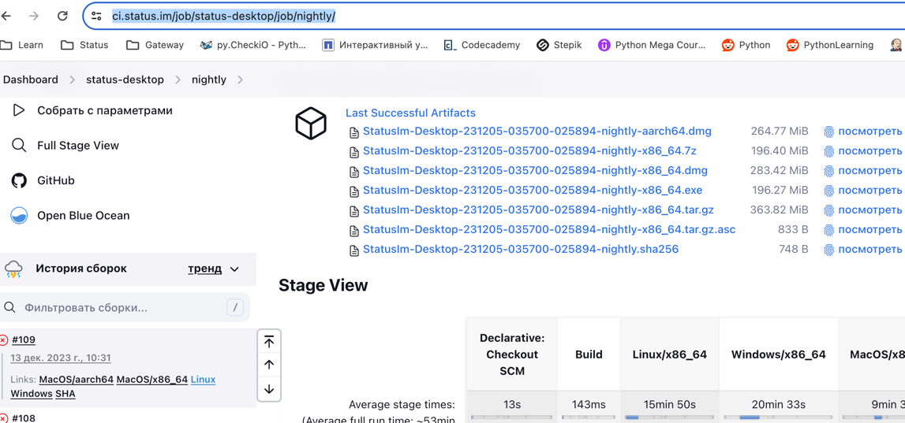
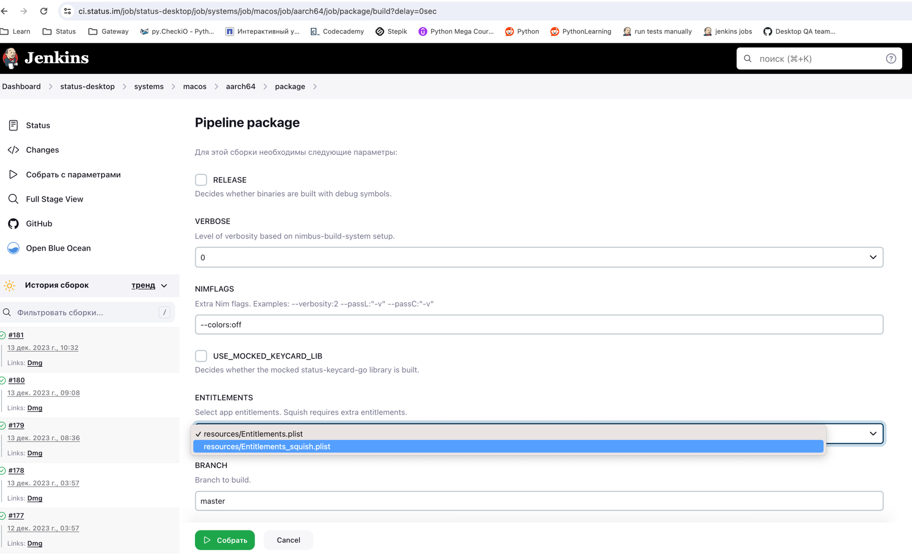

# This repository manages UI tests for desktop application

## How to set up your environment

1. **MacOS**: https://www.notion.so/Mac-arch-x64-and-Intel-50ea48dae1d4481b882afdbfad38e95a
2. **Linux**: https://www.notion.so/Linux-21f7abd2bb684a0fb10057848760a889
3. **Windows**: https://www.notion.so/Windows-fbccd2b09b784b32ba4174233d83878d

## Which build to use

1. you _can_ use your local dev build but sometimes tests hag there. To use it, just place a path to the executable to AUT_PATH in your _local.py config,
for example `AUT_PATH = "/Users/anastasiya/status-desktop/bin/nim_status_client"`

2. normally, please use CI build. Grab recent one from Jenkins job https://ci.status.im/job/status-desktop/job/nightly/

    **2.1** Linux and Windows could be taken from nightly job
    

3. **Note:** on windows you have to escape slashes and use the bin from StatusApp folder:
for example `"C:\\Users\\anast\\AppData\\Local\\StatusApp\\bin\\Status.exe"

    **2.2** Mac **requires entitlements**  for Squish which we don't add by default, so please go here https://ci.status.im/job/status-desktop/job/systems/job/macos/
and select architecture you need (arm or intel), click Build with parameters and select Squish entitlements. Select a branch if u like (master is default)
    

## Pytest marks used

You can run tests by mark, just use it like this in command line:

```bash
python3 -m pytest -m critical
```

or directly in pycharm terminal:

```bash
pytest -m critical
```

You can obtain the list of all marks we have by running this `pytest --markers`

- `critical`, mark used to select the most important checks we do for PRs in desktop repository 
(the same for our repo PRs)
- `skip`, used to just skip tests for various reasons, normally with a ticket linked
- `timeout(timeout=180, method="thread")`, to catch excessively long test durations like deadlocked or hanging tests.
This is done by `pytest-timeout` plugin