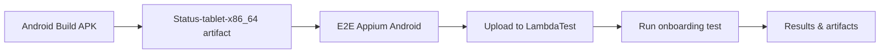

# E2E Appium Android Testing Guide

E2E testing for Status Desktop using GitHub Actions and LambdaTest.

## Quick Start

### 1. Set Up LambdaTest Credentials (One Time)

Repository admins need to add these GitHub secrets:
- `LT_USERNAME` - Your LambdaTest username  
- `LT_ACCESS_KEY` - Your LambdaTest access key

### 2. Build APK (if needed)

1. **Go to Actions** → [Android Build APK](https://github.com/status-im/status-desktop/actions/workflows/android-build.yml)
2. **Set architecture to `x86_64`** (required for LambdaTest)
3. **Click "Run workflow"**
4. **Note the artifact name** (e.g., `Status-tablet-x86_64`)

### 3. Run E2E Tests

1. **Go to Actions** → [E2E Appium Android](https://github.com/status-im/status-desktop/actions/workflows/e2e-appium-android.yml)
2. **Click "Run workflow"**
3. **Set parameters**:
   - **APK source type**: `github_artifact` (default)
   - **APK source**: `Status-tablet-x86_64` (from step 2)
   - **Build run ID**: `123456` (optional - from Android Build URL)
   - **Test selection type**: `marker` (default)
   - **Test target**: `onboarding` (default)
4. **Click "Run workflow"**

## What Gets Tested

**Single Test**: Complete onboarding flow
- Welcome screen → Create profile
- Analytics screen → Skip analytics  
- Create profile screen → Let's go!
- Password screen → Set password
- Loading screen → Wait for completion
- Main app → Verify loaded

**Device**: Galaxy Tab S8 (Android 14) on LambdaTest cloud

## Workflow Overview



## Results & Reports

### GitHub Actions UI
- ✅/❌ Pass/fail status in Actions tab
- 📊 Test summary with links to source build
- ⏱️ Execution time and environment details

### Downloadable Artifacts
- Dynamic artifact name: `e2e-results-TIMESTAMP-TARGET-DEVICE` contains:
  - **`e2e-results.html`** - Detailed test report
  - **`screenshots/`** - Screenshots of each test step
  - **`logs/`** - Debug logs for troubleshooting

### LambdaTest Dashboard
- **Build name**: `Status-Desktop-E2E-{run_number}`
- **Live video** of test execution
- **Device logs** and performance metrics

## Usage Patterns

### Standard Testing Flow
```bash
1. Developer builds x86_64 APK → Android Build APK workflow
2. QA gets artifact name from build → Status-tablet-x86_64
3. QA triggers E2E tests → E2E Appium Android workflow
4. QA reviews results → HTML reports + LambdaTest dashboard
```

### Quick Reference
```yaml
# Typical workflow parameters
APK artifact name: Status-tablet-x86_64
Build run ID: 12345 (optional)
Test environment: lambdatest
Test target: onboarding
Device config: default (Galaxy Tab S8)
```

## Architecture Requirements

### ⚠️ LambdaTest Compatibility
- **Only x86_64 APKs** work on LambdaTest
- ARM64/ARM builds cannot be tested on cloud
- Build x86_64 specifically for E2E testing

### Local Testing Option
For ARM64 APKs or development:
```yaml
APK source type: github_artifact
APK source: Status-tablet-arm64
Test environment: local  # Requires local Appium setup
```

## Workflow Input Options

### APK Sources
- **GitHub artifact**: `Status-tablet-x86_64` (recommended)
- **Direct URL**: `https://example.com/app.apk`
- **LambdaTest ID**: `lt://APP123456789`

### Test Selection
- **By marker**: `onboarding`, `smoke`, `critical`
- **Specific test**: `test_onboarding_flow.py::test_complete_flow`
- **Test file**: `test_onboarding_flow.py`
- **Custom**: Custom pytest expression

### Device Options
- **default**: Galaxy Tab S8 (Android 14)
- **pixel_tablet**: Google Pixel Tablet
- **galaxy_tab_a**: Samsung Galaxy Tab A

## Troubleshooting

### APK Artifact Not Found
- ✅ Verify artifact name exactly matches build output (`Status-tablet-x86_64`)
- ✅ Check build run ID if using cross-repository artifacts
- ✅ Ensure Android Build workflow completed successfully

### LambdaTest Upload Fails
- ✅ Verify credentials in repository secrets
- ✅ Check APK is valid x86_64 build
- ✅ Review upload logs for specific error

### Test Execution Fails
- ✅ Download test results artifact (name includes timestamp)
- ✅ Open HTML report for step-by-step analysis
- ✅ Check screenshots for visual debugging
- ✅ Review logs for technical details

### Missing Test Results
- ✅ Check if test started (look for pytest execution in logs)
- ✅ Verify Python dependencies installed correctly
- ✅ Ensure test file exists in framework

## Manual Testing Commands

If you need to run tests manually:

```bash
# Local testing (requires Appium setup)
export LOCAL_APP_PATH="/path/to/Status-tablet.apk"
cd test/e2e_appium
pytest tests/test_onboarding_flow.py::TestOnboardingFlow::test_complete_onboarding_flow --env=local -v

# LambdaTest testing (with uploaded app)
export STATUS_APP_URL="lt://your_app_id"
pytest tests/test_onboarding_flow.py::TestOnboardingFlow::test_complete_onboarding_flow --env=lambdatest -v
```
