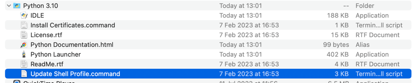
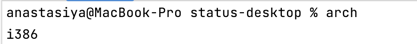
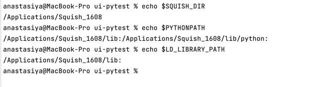

# Status desktop ui-tests

# Setup:
Skip any of the steps, if sure that you have the correct version of the required tool.
## 1. All Platforms
### 1.1 Install Qt 5.15
https://doc.qt.io/qt-6/get-and-install-qt.html
### 1.2 Setup Squish License Server
https://hackmd.io/@status-desktop/HkbWpk2e5
### 1.3 Install PyCharm
Download and install:
https://www.jetbrains.com/pycharm/download/other.html
Please, select any build depending on OS, but NOT an Apple Silicon (dmg)

How to: https://www.jetbrains.com/help/pycharm/installation-guide.html

## 2 Windows
### 2.1 Install Squish
https://status-misc.ams3.digitaloceanspaces.com/squish/squish-7.1-20230301-1424-qt515x-win64-msvc142.exe
### 2.1 Install Python
Download and install for all users: https://www.python.org/ftp/python/3.10.11/python-3.10.11-amd64.exe
### 2.3 Install Requirements
```
YOUR_PYTHON_PATH/Scripts/pip3.10.exe install -r ../ui-pytest/requirements.txt
```
### 2.4 Setup Environment Variables
Add in system environment variables:
```
SQUISH_DIR=PATH_TO_THE_SQUISH_ROOT_FOLDER
PYTHONPATH=%SQUISH_DIR%/bin;%SQUISH_DIR%/lib;%SQUISH_DIR%/lib/python
PATH=YOUR_QT_PATH/5.15.2/msvc2019_64/bin
```
RESTART PC
### 2.5 Verify environment variables
```
echo %SQUISH_DIR%
echo %PYTHONPATH%
```
### 2.6 Setup Python for Squish
Download 'PythonChanger.py' in %SQUISH_DIR%: 
https://kb.froglogic.com/squish/howto/changing-python-installation-used-squish-binary-packages/PythonChanger.py
```
YOUR_PYTHON_PATH/python3.10.exe SQUISH_DIR/PythonChanger.py --revert
YOUR_PYTHON_PATH/python3.10.exe SQUISH_DIR/PythonChanger.py
```
- Replace "YOUR PYTHON PATH" on to Python3.10 file location path 
- Replace "SQUISH DIR" on to the Squish root folder path


## 2 Linux
### 2.1 Install Squish
https://status-misc.ams3.digitaloceanspaces.com/squish/squish-7.1-20230222-1555-qt515x-linux64.run
### 2.2 Install Python
```bash
sudo apt-get install software-properties-common
```
```bash
sudo add-apt-repository ppa:deadsnakes/ppa
```
```bash
sudo apt-get update
```
```bash
sudo apt-get install python3.10
```
```bash
sudo apt install python3-pip
```
### 2.3 Install Requirements
Download and install tesseract-ocr https://github.com/UB-Mannheim/tesseract/wiki
```bash
sudo apt install tesseract-ocr
```
```bash
sudo pip3 install -r ../ui-pytest/requirements.txt
```
### 2.4 Setup Environment Variables
```bash
gedit ~/.profile
```
```
export SQUISH_DIR=PATH_TO_THE_SQUISH_ROOT_FOLDER
export PYTHONPATH=$SQUISH_DIR/lib:$SQUISH_DIR/lib/python:$PYTHONPATH
export LD_LIBRARY_PATH=$SQUISH_DIR/lib:$SQUISH_DIR/python3/lib:$LD_LIBRARY_PATH
```
RESTART PC

## 2. Mac (with arm64 architecture)
### 2.1 Install Squish
https://status-misc.ams3.digitaloceanspaces.com/squish/squish-7.1-20230328-1608-qt515x-macaarch64.dmg

### 2.2 Install Intel Python

**NOTE for M1 / M2 users**: homebrew Python installations only seem to support the ARM64 architecture,  
so please install **Python UNIVERSAL version** from [python.org](https://www.python.org/downloads/macos/) via installer
and after successful installation, please run `Update Shell Profile.command` script from intel based terminal
(this terminal will be open when running Intel-based Pycharm version). To check the architecture, run `arch` command
in terminal. Intel-based terminal returns `i386`





**Restart the terminal, or better - your laptop**

### 2.3 Install Requirements and tesseract

```bash
arch -x86_64 /Library/Frameworks/Python.framework/Versions/3.10/bin/python3.10 install -r ../ui-pytest/requirements.txt
```

1. install macPorts for yourmacOS version https://github.com/macports/macports-base/releases/tag/v2.8.1
2. install tesseract https://tesseract-ocr.github.io/tessdoc/Installation.html

### 2.4.a Setup Environment Variables to your zprofile
```bash
touch ~/.zprofile
open ~/.zprofile
```
```
export SQUISH_DIR="PATH_TO_THE_SQUISH_ROOT_FOLDER"
export PYTHONPATH=$SQUISH_DIR/lib:$SQUISH_DIR/lib/python:$PYTHONPATH
export LD_LIBRARY_PATH=$SQUISH_DIR/lib:$LD_LIBRARY_PATH
```

### 2.4.b Setup Environment Variables to your .zshrc profile
```
export PATH="/usr/local/bin/python3:$PATH"
```


### 2.4.1 Pillow
```bash
sudo open /etc/gdm3/custom.conf
```
Uncomment the line: `WaylandEnable=false` to force the login screen to use Xorg and save changes

RESTART PC

## 2 Linux and MAC:
### 2.5 Verify environment variables
```bash
echo $SQUISH_DIR
echo $PYTHONPATH
echo $LD_LIBRARY_PATH
```



### 2.6. Replace Squish build-in Python with your local Python 3.10

Squish comes with build-in Python version 3.10 which does not work with pytest. To make pytest work, there is a need 
to execute a scrip, that is provided by Froglogic, to replace the built-in Python with system python3.10

https://kb.froglogic.com/squish/howto/changing-python-installation-used-squish-binary-packages/

```bash
brew install wget
wget -O $SQUISH_DIR/PythonChanger.py https://kb.froglogic.com/squish/howto/changing-python-installation-used-squish-binary-packages/PythonChanger.py
arch -x86_64 /Library/Frameworks/Python.framework/Versions/3.10/bin/python3.10 $SQUISH_DIR/PythonChanger.py --revert
arch -x86_64 /Library/Frameworks/Python.framework/Versions/3.10/bin/python3.10 $SQUISH_DIR/PythonChanger.py
```

### Launch tests examples:
```
echo "Executing tests located in 'test_self.py' file"
pytest ./tests/test_self.py
echo "Executing test 'test_import_squish' from 'test_self.py' file"
pytest ./tests/test_self.py::test_import_squish
echo "Executing all tests with 'import_squish' in test name"
pytest -k import_squish
echo "Executing all tests with tag 'self'"
pytest -m self
```
For more info, read: https://docs.pytest.org/en/latest/getting-started.html
